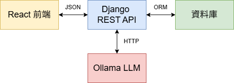

# 🧑‍💻 WebAPI Project – React + Django + Ollama

## 📖 專案簡介
這是一個全端專案，前端使用 **React + TailwindCSS**，後端使用 **Django REST Framework (DRF)**，並整合 **Ollama** 作為本地 LLM 回覆機器人。  
系統支援 **JWT 身分驗證**，使用者登入後可以與 AI 對話，並將聊天紀錄儲存在資料庫中（每位使用者擁有自己的紀錄）。

---

## 🚀 功能特色
- 使用者註冊 / 登入（JWT 認證）
- 前後端 JSON 傳輸
- 聊天 API：傳送訊息並獲得 Ollama LLM 回覆
- 使用者專屬聊天紀錄（存於 DB）
- 前端 UI 響應式（支援電腦 & 手機）

---

## 🛠️ 系統架構

- **React (Vite + TailwindCSS)**：登入、註冊、聊天 UI  
- **Django (DRF + SimpleJWT)**：RESTful API + JWT 驗證  
- **Ollama**：本地語言模型 (llama3.1:8B)  
- **Database**：儲存使用者與聊天紀錄  

---

## 🔐 身分驗證流程

1. 使用者註冊 (`/api/register/`) → 儲存帳號與加密密碼  
2. 使用者登入 (`/api/token/`) → 回傳 `access` & `refresh` token  
3. 前端將 `access token` 存入 localStorage  
4. 呼叫需要驗證的 API（如 `/api/chat/`）時，帶上 Header：  

## 環境建置

-**前端**

cd frontend
npm install
npm run dev

-**後端**

pip install -r requirements.txt
cd backend
python manage.py migrate
python manage.py runserver

-**Ollama 啟動**

ollama run llama3.1:8b
